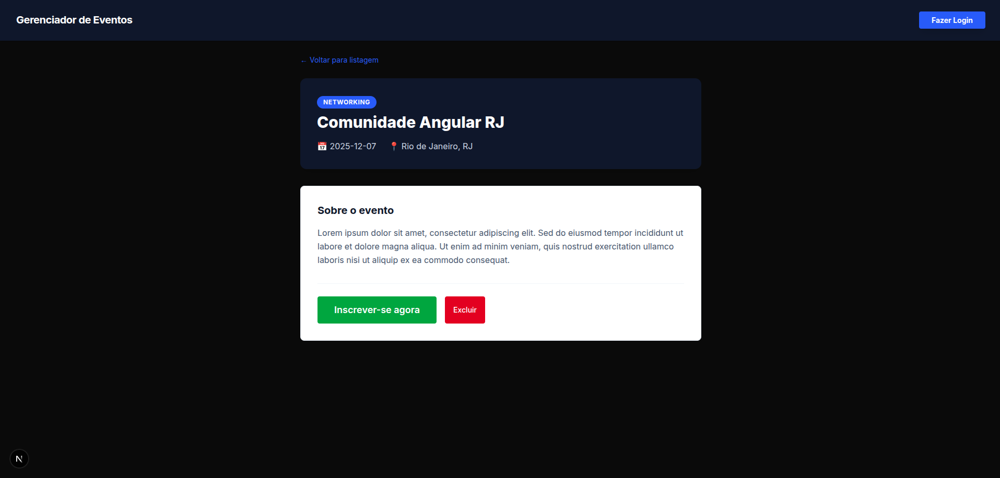
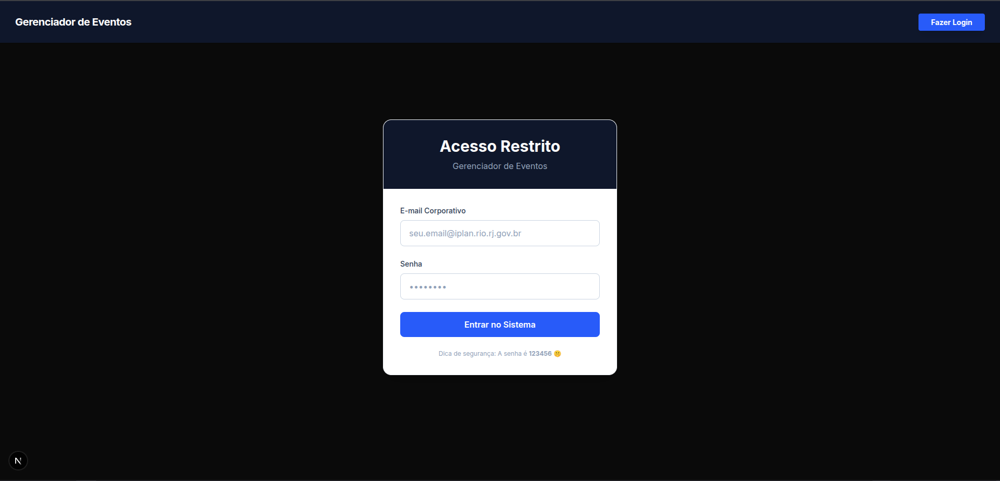

# 📅 Gerenciador de Eventos (Next.js 15+)

Sistema de gerenciamento de eventos desenvolvido como desafio técnico. O projeto permite visualizar, buscar, paginar e gerenciar eventos (CRUD), utilizando uma arquitetura moderna com **Next.js 15 (App Router)** e **Server Components**.

## 🚀 Tecnologias

- **Framework:** Next.js 15.0+ (App Router)
- **Linguagem:** TypeScript
- **Estilização:** Tailwind CSS
- **Estado Global:** React Context API (Auth Mock)
- **Feedback Visual:** React Hot Toast (Notificações)
- **API:** Next.js API Routes (Backend Mockado)

## ⚙️ Funcionalidades

- [x] **CRUD Completo:** Criação, Leitura e Exclusão de eventos.
- [x] **Paginação:** Navegação otimizada entre listas de eventos.
- [x] **Busca em Tempo Real:** Filtragem por título ou categoria.
- [x] **Detalhes Dinâmicos:** Rotas individuais (`/events/[id]`) com dados atualizados.
- [x] **Autenticação Simulada:**
  - Login com validação de credenciais.
  - Proteção de rotas privadas (Middleware/Context).
  - Feedback de carregamento e erro.
- [x] **UX Aprimorada:**
  - Confirmação interativa para exclusão.
  - Toasts de sucesso e erro.
  - Estados de loading em botões.
- [x] **Design Responsivo:** Layout fluido para Mobile e Desktop.

## 📸 Galeria do Projeto

### 🏠 Dashboard e Detalhes
| Tela Inicial (Listagem e Busca) | Detalhes do Evento |
| :---: | :---: |
|  |  |

### 🔐 Área Administrativa
| Login & Validação | Cadastro de Eventos | Confirmação de Exclusão |
| :---: | :---: | :---: |
|  |  |  |

> *O sistema conta com feedback visual (Toasts) para todas as ações do usuário.*

## 🔐 Credenciais de Acesso

Para testar as funcionalidades administrativas (Criar e Excluir eventos), utilize as credenciais abaixo na tela de login:

- **E-mail:** `teste@iplan.rio.rj.gov.br` (ou qualquer e-mail válido)
- **Senha:** `123456`

## 📦 Como rodar o projeto

1. **Clone o repositório:**
   ```bash
   git clone [https://github.com/marcos-lima-dev/desafio-tecnico-analista-de-sistemas-Junior-front-end.git](https://github.com/marcos-lima-dev/desafio-tecnico-analista-de-sistemas-Junior-front-end.git)
   cd desafio-tecnico-analista-de-sistemas-Junior-front-end
Instale as dependências:

Bash

npm install
Rode o servidor de desenvolvimento:

Bash

npm run dev
Acesse: abra http://localhost:3000 no seu navegador.

📝 Notas do Desenvolvedor
Persistência de Dados: Como este é um desafio técnico com foco em Front-end, não foi utilizado banco de dados externo. A persistência é feita em memória (src/data/events.ts).

Nota: Ao reiniciar o servidor (ou salvar arquivos em dev mode), os dados criados via navegador são resetados para o estado inicial, enquanto os dados "hardcoded" no arquivo permanecem fixos.

Next.js 15 Compliance: O projeto segue estritamente as novas convenções do Next 15, incluindo o uso de await params em rotas dinâmicas e revalidação de cache sob demanda (router.refresh).

Feito com 💙 por Marcos de Sousa Lima